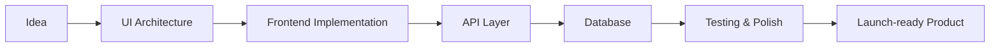

<div align="center">


<p>
  <a href="mailto:zypheris@outlook.com"></a>
  <a href="https://discord.com/users/773582512647569409"></a>
  <a href="https://instagram.com/zypheris777"></a>
  <a href="https://open.spotify.com/user/314c4qgsafgrqtpd6tnfandxnkzq"></a>
</p>


</div>

---

<table>
<tr>
<td width="58%" valign="top">

## Who I Am

```ts
type Stack = {
  frontend: string[];
  backend: string[];
  database: string[];
  tools: string[];
};

const zypheris = {
  name: "Yusuf",
  role: "Full-Stack Developer",
  location: "Turkey",
  style: "clean UI, solid APIs, readable code",
  stack: {
    frontend: ["React", "Next.js", "Tailwind CSS", "Bootstrap"],
    backend: ["Node.js", "Express", ".NET"],
    database: ["MongoDB", "MySQL"],
    tools: ["Git", "Discord.js", "VS Code", "PowerShell"]
  } satisfies Stack
};
```

I like building complete products: the interface people touch, the backend that keeps it reliable, and the small details that make everything feel smooth.

</td>
<td width="42%" valign="top">

## Focus

<table>
  <tr>
    <td><b>01</b></td>
    <td>Modern web interfaces</td>
  </tr>
  <tr>
    <td><b>02</b></td>
    <td>REST APIs and backend services</td>
  </tr>
  <tr>
    <td><b>03</b></td>
    <td>Database design and data flow</td>
  </tr>
  <tr>
    <td><b>04</b></td>
    <td>Discord bots and automation</td>
  </tr>
</table>

## Working Style

- Product-first thinking
- Clean component structure
- Practical backend architecture
- Code that is easy to revisit

</td>
</tr>
</table>

## Tech Arsenal

<div align="center">

### Frontend


### Backend & Data


### Languages & Tools


</div>

## Build Map



## GitHub Signal

<div align="center">


<br />


<br />


</div>

## Current Mode

<table>
<tr>
<td width="25%"><b>Learning</b></td>
<td>Better backend structure, authentication patterns and scalable project organization.</td>
</tr>
<tr>
<td width="25%"><b>Building</b></td>
<td>Full-stack apps, Discord tools, dashboards and automation utilities.</td>
</tr>
<tr>
<td width="25%"><b>Improving</b></td>
<td>UI polish, API consistency, database reliability and developer experience.</td>
</tr>
</table>

## Contact

<div align="center">

<a href="mailto:zypheris@outlook.com">
  
</a>

<br />
<br />

<sub>Full-stack development with clean structure, sharp interfaces and reliable systems.</sub>

</div>
