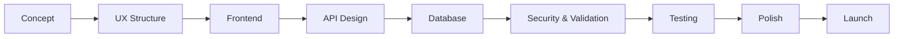

  
  
  
  

  
  
  

---

<table>
<tr>
<td width="55%" valign="top">

<h2>Developer Profile</h2>

<pre><code class="language-ts">const zypheris = {
  name: "Yusuf",
  role: "Full-Stack Developer",
  location: "Turkey",
  mainStack: ["React", "Next.js", "Node.js", "Express", ".NET"],
  databases: ["MongoDB", "MySQL"],
  languages: ["TypeScript", "JavaScript", "Python", "C++", "C#", "Lua", "Kotlin"],
  principle: "Build clean, useful and maintainable products."
};</code></pre>

I build web applications from interface to backend: structured components, clean APIs, practical database design and polished user flows. I care about products that are not only working, but also easy to use and easy to maintain.

</td>
<td width="45%" valign="top">

<h2>Engineering DNA</h2>

<table>
  <tr>
    <td><b>Frontend</b></td>
    <td>Responsive layouts, reusable components, smooth UX</td>
  </tr>
  <tr>
    <td><b>Backend</b></td>
    <td>REST APIs, services, auth flows, clean architecture</td>
  </tr>
  <tr>
    <td><b>Database</b></td>
    <td>Readable schemas, practical queries, safe data flow</td>
  </tr>
  <tr>
    <td><b>Automation</b></td>
    <td>Discord bots, tooling, workflow shortcuts</td>
  </tr>
</table>

 

</td>
</tr>
</table>

## Tech Arsenal

<table>
<tr>
<td align="center" width="33%">
<h3>Frontend</h3>

 
Interfaces, dashboards, app shells and design systems
</td>
<td align="center" width="33%">
<h3>Backend</h3>

 
APIs, services, authentication and business logic
</td>
<td align="center" width="33%">
<h3>Data & Tools</h3>

 
Databases, version control and developer workflow
</td>
</tr>
</table>

 

## Product Pipeline

## What I Build

<table>
<tr>
<td width="25%" valign="top">
<h3>Web Apps</h3>

Modern, responsive applications with clean interfaces and reusable UI structure.

</td>
<td width="25%" valign="top">
<h3>Dashboards</h3>

Data-focused panels that make complex information easier to scan and manage.

</td>
<td width="25%" valign="top">
<h3>APIs</h3>

Backend systems with predictable routes, validation and maintainable service logic.

</td>
<td width="25%" valign="top">
<h3>Bots</h3>

Discord tools, automation flows and small utilities that save time.

</td>
</tr>
</table>

## GitHub Signal

 
 

 
 

 
 

## Current Mode

<table>
<tr>
<td width="25%"><b>Learning</b></td>
<td>Backend architecture, authentication patterns, scalable folder structures and better deployment habits.</td>
</tr>
<tr>
<td width="25%"><b>Building</b></td>
<td>Full-stack applications, Discord tools, admin panels, dashboards and automation utilities.</td>
</tr>
<tr>
<td width="25%"><b>Improving</b></td>
<td>UI polish, API consistency, database reliability, code quality and developer experience.</td>
</tr>
<tr>
<td width="25%"><b>Exploring</b></td>
<td>Better product thinking, cleaner system design and smarter tools for daily development.</td>
</tr>
</table>

## Principles

<table>
<tr>
<td align="center" width="33%"><b>Readable code</b> Future-you should understand it fast.</td>
<td align="center" width="33%"><b>Useful features</b> Build what improves the product.</td>
<td align="center" width="33%"><b>Finished feeling</b> Details matter after it works.</td>
</tr>
</table>

## Contact

 
 

Clean interfaces. Reliable systems. Products that feel complete.

